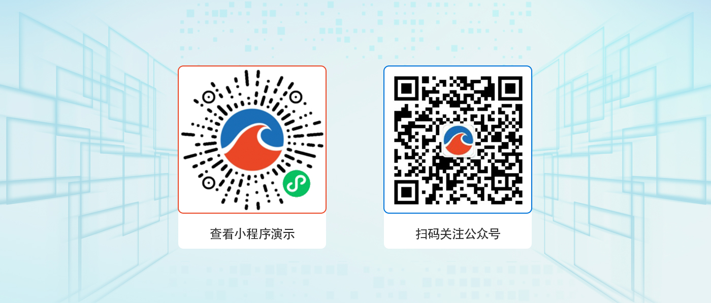
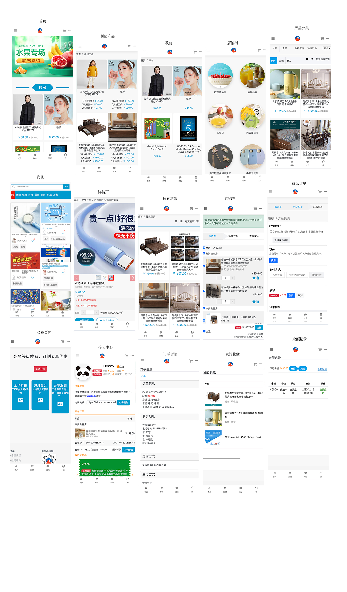
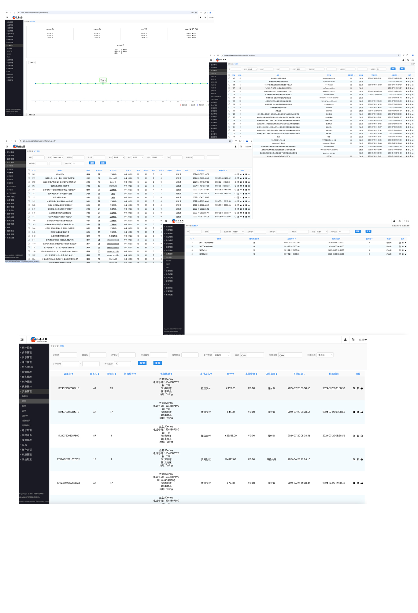

<div align="center" >
    
</div>
<div align="center">红海互联开源商城系统 PHP 版</div>

<div align="center">

[官网](https://www.redseanet.com/) |
[在线体验](http://www.store.redseanet/) |
[帮助文档](https://www.redseanet.com/) |

</div>

---

### 更新说明

点击查看<a href="https://www.redseanet.com/doc/ecomphp_change_summary.html" target="_blank">更新记录</a>

### 介绍

红海社交 PHP 版电商系统类似小红书这样的电商系统，店家或博主用文案或视频引流给自己的店铺和产品，留言和评论和用户互动，提高服务。基于 Laminas 和 Symfony 部件开发，php8.1+Mysql+Redis+RabitMQ ， 容器 Docker 部署，能轻松上手！ 设计得非常灵活，具有模块化架构体系和丰富的功能。易于与第三方应用系统无缝集成。在设计上，包含相当全面，以模块化架构体系，让应用组合变得相当灵活，功能也相当丰富。为了打开盈利途径，同时具备收费的企业版本，积极谋求合作和第三方整合的工具，比如电子支付,分销分成功能等。

---

### 系统亮点

```
1.定制化高且灵活: yml控制前端页面显示， 可以灵活地控制不同主题模块显示； 后端使用EAV模型设计， 数椐(产品，用户)属性灵活定制；
2.前后端分离: 后端PHP+Mysql， 前端使用Boostrap5, 可以有不同的主题， 可以轻松切换；
3.代码规范:遵循PSR-2命名规范、Rpc标准接口、代码严格分层、注释齐全、统一错误码；
4.定时任务: 灵活自定义定时任务， 统一管理。
5.接口管理:后台页面可以看到系统中所有的接口数据，提供完整的API接口给小程序或APP使用。
6.高 性 能: 使用Redis，缓存数椐； 在搜索里可以用Elasticsearch; 使用RabbitMQ;
7.多 语 言: 整个系统支持多语言， 可以自行增减语言支持；
8.后台权限管理：内置强大灵活的权限管理，可以控制到每一个菜单；

```

### 系统演示



管理后台： https://store.redseanet.com/admin

账号：
用户名： demo 
redseanet.com

PC/WAP 端：http://store.redseanet/ （电脑/手机打开）

---

### 核心功能

系统功能

```
移动端支持：PC和手机端响应式布局；
多种风格和布局切换：可以在后台进行主题切换；
多种语言配置：支持多语言；
对外接口：包含用户、商品、订单等接口，方便其它系统对接；
多种云储存：阿里云、AWS云；
```

商城功能

```
多种支付方式：微信支付、支付宝支持；
多种商品类型：标准商品、虚拟商品、卡密商品；
多种营销功能：拼团、砍价、优惠券、积分、充值、渠道码；
多种运费方式：快递、配送、自提、包邮、超强运费模版管理、多自提点；
灵活的产品属性： 可以适应不同产品；
产品评论/评分： 产品评论/评分功能；
```

用户管理

```
用户等级：用户等级 经验升级 经验任务；
用户组：付费会员 试用会员 会员权益
用户管理：用户类型 添加用户 用户标签/分组 用户操作 浏览记录
登录方式：微信快速登录 密码登录/注册
微信端登录：微信授权登录 手机号快速登录 账号密码登录
```

CMS 管理

```
文章内容
文章管理
文章分类
文章列表
内容块管理
```

交易

```
购物车
订单
账单
运单
退款单
退货退款
订单状态
```

推广社区

```
帖子（图文，视频）
主题
留言/回复
关注博主
帖子推荐产品
```

---

### UI 界面展示



---

### 后台界面展示



---

### 运行环境

```

Nignx（推荐）/Apache
PHP8.1
MySQL 8.0
Redis （可选）
RabbitMQ
Elasticsearch（可选）

```

---

欢迎<a href="#" target="_blank">反馈问题</a>

欢迎<a href="#" target="_blank">提交代码</a>


---

## 如何参与贡献

Fork 库出来, 编辑和 [提交一个 PR](https://github.com/).

请清楚地描述提交和 PR 的信息，空的描述和不清楚的描述， PR 会被没有原因驳回；

---

## 联系我们

邮箱： [info@redseanet.com](info@redseanet.com)

微信： 


(≧∀≦)ゞ原创团队长期承接定制开发服务， 欢迎来聊(≧∀≦)ゞ。

---

### 版权须知

Apache License 2.0 许可的主要内容包括：

1. 授权：允许任何人以任何目的使用、复制、修改和分发该软件。

2. 版权声明：要求在软件和相关文档中包含原始版权声明和许可证声明。

3. 保证免责：表明该软件是按现状提供的，没有任何明示或暗示的担保或保证。作者不承担任何赔偿责任。

4. 贡献者授权：要求所有贡献者授予 Apache 软件基金会永久性的、免费的、不可撤销的许可，以使用、复制、修改和分发其贡献。

5. 专利许可：为了保护使用该软件的用户，该许可要求贡献者授权任何必要的专利许可，以便将其用于 Apache 软件基金会的项目。

Apache License 2.0 是一种宽松的开源许可，允许人们自由使用、修改和分发软件。

---

### 版权信息

本项目包含的第三方源码和二进制文件之版权信息另行标注。

版权所有 Copyright © 2019~2024 by 红海互联 (https://www.redseanet.com)

All rights reserved。

著作权所有者为深圳红海互联科技有限公司。

---

```

```
